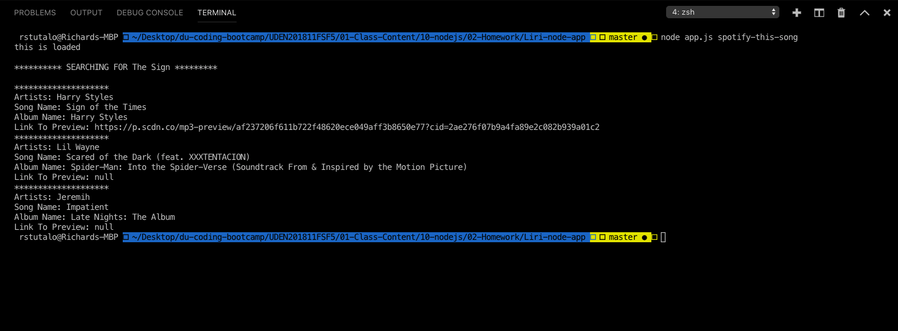

# Liri-node-app
This a Language Interpretation and Recognition Interface application using Node.js. 

# Overview
Since this is a CLI(Command Line) application, there will be no reference or links to any external html pages or cascading stylesheets. The application itself makes use of a few different Node packages via [NPMjs](https://www.npmjs.com/). The full list of installed packages can be found [here](https://github.com/rstootalow/Liri-node-app/blob/master/package.json). A more granular look in to those npm packages can be found below. 

## NPM Packages

#### [Axios](https://www.npmjs.com/package/axios): This package was installed to be able to leverage various APIs by making http requests directly from Node.js.   

<code>npm install axios</code>

#### [Dotenv](https://www.npmjs.com/package/dotenv): This package was used to store variables of api keys and passwords that I would like to keep private as I publish my project on GitHub pages, while still having access to the APIs I used in this project.   

<code>npm install dotenv</code>

#### [Moment](https://www.npmjs.com/package/moment): This package was used to convert dates and times from Axios responses in to more readable formats.   

<code>npm install moment</code>

#### [Node-Spotify-Api](https://www.npmjs.com/package/node-spotify-api): A library of the various API calls users can make to the Spotify API.   

<code>npm install node-spotify-api</code>
   
## APIs Used

#### [OMDB](http://www.omdbapi.com): A RESTful API for movie databases. In the Liri application, users are able to request a number of different categories for any movie they search for. 

#### [Bands In Town](http://www.artists.bandsintown.com/bandsintown-api): Another RESTful API. In the Liri application, users can leverage this API to find past, present, or upcoming concert dates of any artist they search for. 

#### [Spotify](https://developer.spotify.com/documentation/web-api/): The user can hit various API endpoints to get any number of values from artists, albums, and songs. For the specific use of this application, the user will be searching by songs. 

## Application Commands and Screenshots

* <code>node app.js</code>
   
By running this command, the application will start with a set of instructions letting the user know how to navigate and perform tasks in the application

* <code>node app.js movie-this {title given}</code>

* <code>node app.js movie-this {no title given}</code>
      
Running this command will automatically default the movie search to the movie "Mr. Nobody"

* <code>node app.js spotify-this-song {song title given}</code>
      
Running this command will send a request to the Spotify API which will return no more than 3 results in case there are multiple matches of that song 

* <code>node app.js spotify-this-song {no song title given}</code>
      
Running this command with no title given with send a request to Spotify with a default song title value of the song "The Sign"

* <code>node app.js concert-this {Name of Artist}</code>
      
Similar to the other requests, this one will return the response from the Bands In Town API with the name of the artist and any past, present, or future dates for upcoming concerts or shows

* <code>node app.js do-what-it-says</code>
      
This command will run a function that will send a request to Spotify and search for the song "I Want It That Way" and return no more than three responses with songs that have that title.

